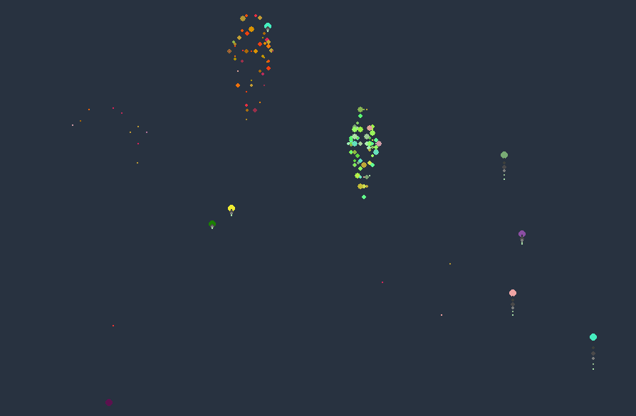

# pyroworks
Fireworks with a little bit of math and python pygame.

- Rockets are being created with randomized color, speed and x-axis position (based on dimensions of the `pygame.Surface`)  
- Rockets rise until they reach peak and explode into particles
- Particles are colored based on variations of the initial rocket's color

```python
r = Rocket()
r.render()
```



